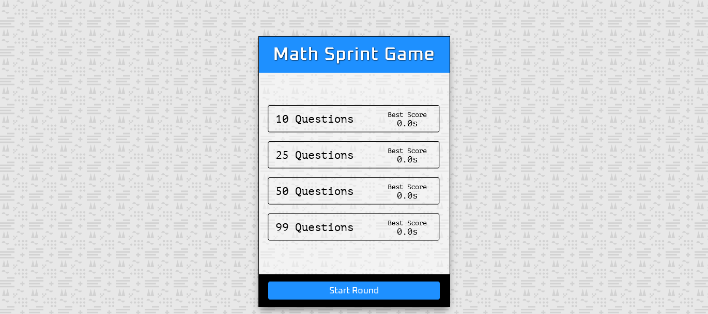

<h1>Math Sprint Game</h1>

<h2>A math game created using HTML, CSS, and JavaScript.</h2>

This game was created using HTML, CSS, and JavaScript that lets you play through 10, 25, 50, and 99 math questions to see how fast you can get through the questions and how many you can get correct. Screenshot of the game.

- Live Site: [Math Sprint Game](https://math-sprint-game-project.netlify.app/)

### Screenshot

